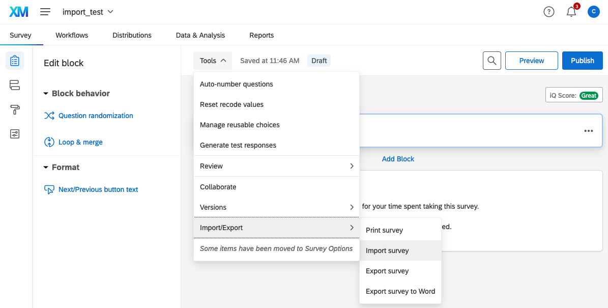
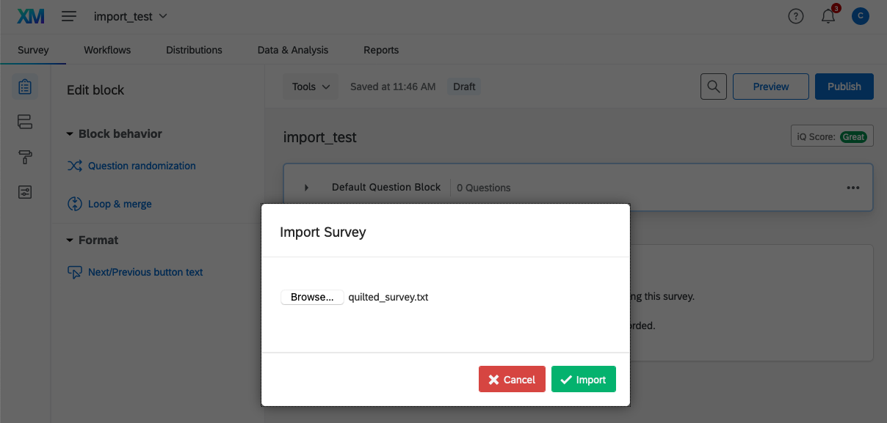

## Overview

The <tt>quiltr</tt> package is designed for generating Qualtrics importable forms for data labelling, in particular text labelling. 

There are two workhorse functions, which are `quilt_form_data()` and `quilt_form`. The first of these takes a dataset of text for labelling and structures it appropriately for writing the Qualtrics data labelling form. The second takes the `data.frame` produced by `quilt_form_data()` and generates a .txt file that is importable into Qualtrics.

In the package are several bundled datasets, which are useful for testing and understanding how the package functions. These are named: `lipsum_text`, `arabiya_text`, and `qdat`.


| Dataset   |     Description      |
|----------|:-------------:|
|lipsum_text | Dataset of (pseudo) random lipsum text generated using the <tt>stringi</tt> package
|arabiya_text | Dataset of Arabic text data sampled from [https://data.mendeley.com/datasets/57zpx667y9/2](https://data.mendeley.com/datasets/57zpx667y9/2)
|qdat | Dataset containing one hundred paragraphs of lipsum text with columns for text (prompt), response_type and ID as generated by `quilt_form_data`

We first load one of these datasets into memory:

```r

data(lipsum_text)

```

We can then call `quilt_form_data()`, which takes the following arguments:

```r

qdat <- quilt_form_data(prompt = "Label this text: ",
                     text = lipsum_text$text, response_type = "scale",
                     nlow = 1, nhigh = 10, addID = T)

```

The `prompt` argument is optional and gives the user the ability to add a prompt before the text for labelling. The second argument is the text to be labelled. Here, we are specifying our dummy `lipsum_text` data and, specifically, the column `lipsum_text$text`. The `response_type` parameter has several options, including "scale" for an integer scale. For this, we then need to specify an upper and lower bound with the `nlow` and `nhigh` parameters. The other options here are "yesno" for a binary yes or no response, and "options," which then requires the additional `options` parameter.

Once we have our data in the appropriate format, we can then generate our Qualtrics importable form with `quilt_form()` as follows:

```r

quilt_form(input_data = qdat,
            page_break_every = 1, question_type = "multianswer",
            filename = "quilted_survey.txt")

```

## Importing to Qualtrics

After we've generated the file in the appropriate format, we can import to Qualtrics. First we go to the survey in question, here named "import_test." We then click on tools and select the "Import/Export" > "Import survey." 

<center>
{width=80%}
</center>

Qualtrics will then prompt us to select the relevant .txt file, which we previously generated with `quilt_form`. We select here "quilted_survey.txt" and press "Import." We have now successfully imported our survey into Qualtrics!

<center>
{width=80%}
</center>
